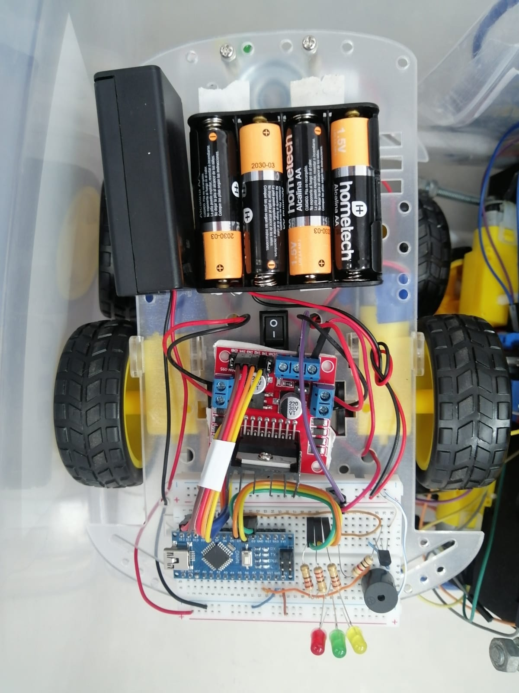
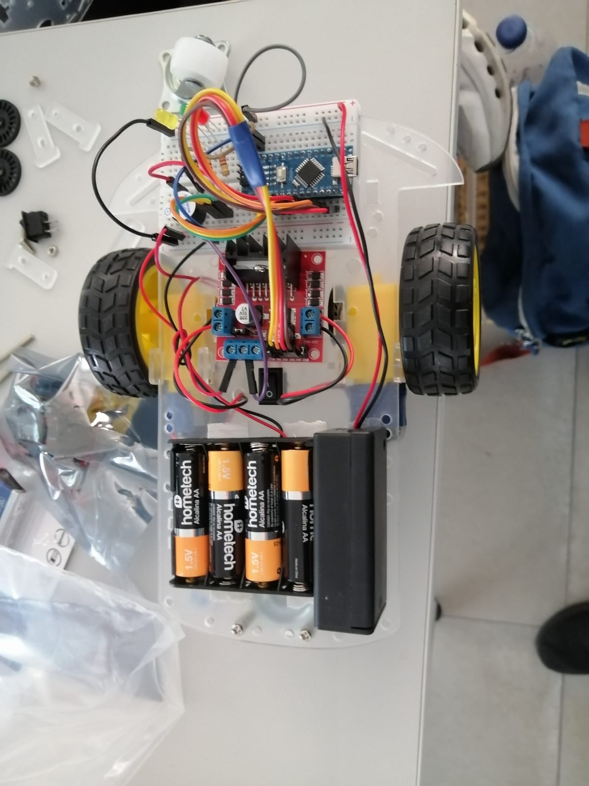

# 🤖 Educational Robotic Car — ESPOL

<p align="center">
  
</p>

Educational robotic car developed as part of the Community Practices program at the Escuela Superior Politécnica del Litoral (ESPOL).

The project was designed as an educational platform to introduce children to basic concepts of robotics, electronics, and programming through a programmable mobile robot.

---

## 📌 Project Overview

The robotic car is based on an Arduino Nano and an L298N motor driver. The system controls two DC motors to perform programmed movements, while LEDs and a buzzer provide visual and audible feedback.

The project includes the physical assembly of the robot, electrical connections, Arduino programming, testing, troubleshooting, and educational documentation.

---

## ⚙️ Main Components

- Arduino Nano
- L298N motor driver
- 2 × DC motors
- 3 × LEDs
- 3 × 220 Ω resistors
- Buzzer
- Battery
- Switch
- Breadboard
- Acrylic chassis
- Wheels

---

## 🔌 System Connections

The Arduino Nano controls the L298N motor driver through four digital outputs. Three additional digital outputs control the LED indicators, while another output controls the buzzer.

### Pin Configuration

| Arduino Nano | Component | Function |
|---|---|---|
| D7 | L298N IN1 | Motor control |
| D6 | L298N IN2 | Motor control |
| D5 | L298N IN3 | Motor control |
| D4 | L298N IN4 | Motor control |
| D8 | Red LED | Movement indicator |
| D9 | Yellow LED | Movement indicator |
| D10 | Green LED | Movement indicator |
| D2 | Buzzer | Audible feedback |

### Wiring Diagram

<p align="center">
  
</p>

---

## 💻 Programming

The robot was programmed using the Arduino IDE and C/C++ for Arduino.

The program includes independent functions for:

- Moving forward
- Moving backward
- Turning right
- Turning left
- Stopping the motors

### Programmed Movement Sequence

The main programmed sequence is:

1. The robot moves forward for 3 seconds.
2. The robot turns right for 0.9 seconds.
3. The robot moves forward for 2.5 seconds.
4. The robot turns left for 0.9 seconds.
5. The robot stops briefly.
6. The sequence repeats.

The LEDs and buzzer provide visual and audible feedback during different stages of the movement sequence.

### Arduino Code

The complete Arduino program is available in:

```text
codigo/carrito_robotico.ino
```

---

## 👨‍💻 My Contribution

I was primarily responsible for the technical development and implementation of the robotic car.

My responsibilities included:

- Purchasing the electronic and mechanical components.
- Physically assembling the robotic car.
- Building and verifying the electrical connections.
- Programming the Arduino Nano.
- Implementing the motor control functions.
- Integrating the LEDs and buzzer.
- Testing the robot's movements.
- Troubleshooting connection and programming issues.
- Helping prepare and test the robot for the educational activities.

My teammate supported the project mainly with the preparation of the operation manual and presentation materials.

---

## 📚 Educational Purpose

The robotic car was developed as an educational tool for teaching basic concepts of robotics, electronics, and programming.

The activities allow students to:

- Identify the main components of the robot.
- Understand the relationship between programming instructions and physical movement.
- Learn the basic operation of an Arduino-based robotic system.
- Modify movement parameters.
- Create and test different movement sequences.
- Develop basic problem-solving and programming skills.

---

## 📸 Project Gallery

### Assembled Robotic Car

<p align="center">
  
</p>

### Electrical Connections

<p align="center">
  
</p>

### Connection Diagram

<p align="center">
  
</p>

---

## 📂 Repository Structure

```text
carrito-robotico-educativo-ESPOL/
│
├── codigo/
│   └── carrito_robotico.ino
│
├── diagramas/
│   └── diagrama_conexiones.png
│
├── documentacion/
│   └── Manual_Operacion_Carrito_Robotico.pdf
│
├── fotos/
│   ├── carrito_armado.jpg
│   └── conexiones_carrito.jpg
│
└── README.md
```

---

## 📖 Documentation

The complete operation and connection manual is available in:

```text
documentacion/Manual_Operacion_Carrito_Robotico.pdf
```

The documentation contains information about the project components, assembly, connections, software configuration, programming, educational activities, testing, and expected learning outcomes.

---

## 🏫 Academic Context

**Institution:** Escuela Superior Politécnica del Litoral (ESPOL)  
**Program:** Community Practices — PAO I 2026  
**Project:** Educational Robotic Car  
**Focus:** Programming and Educational Robotics

---

## 🛠️ Technologies and Skills

### Hardware

- Arduino Nano
- L298N motor driver
- DC motors
- LEDs
- Buzzer
- Breadboard
- Battery-powered system

### Software

- Arduino IDE
- C/C++ for Arduino

### Skills Demonstrated

- Arduino programming
- Embedded systems
- Basic electronics
- Motor control
- Electrical wiring
- Hardware integration
- Robotics
- Troubleshooting
- Technical documentation
- Educational robotics

---

## 🚀 Future Improvements

Possible improvements for future versions of the robotic car include:

- Adding wireless remote control.
- Adding ultrasonic sensors for obstacle detection.
- Implementing autonomous navigation.
- Adding speed control using PWM.
- Adding more interactive educational activities.
- Improving the mechanical design of the chassis.
- Adding additional sensors for robotics experiments.

---

## 📄 Project Documentation

For detailed information about the operation, connections, programming, and educational activities, refer to the project manual located in the `documentacion/` folder.

---

<p align="center">
  Developed as part of my Community Practices at ESPOL.
</p>
